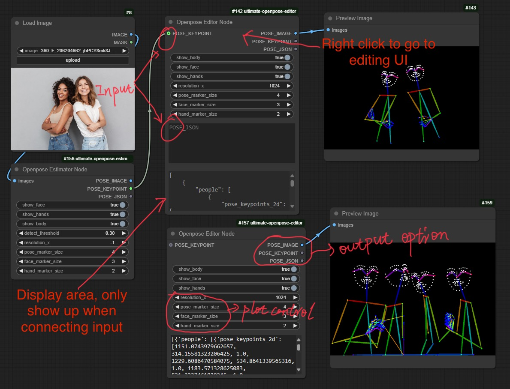
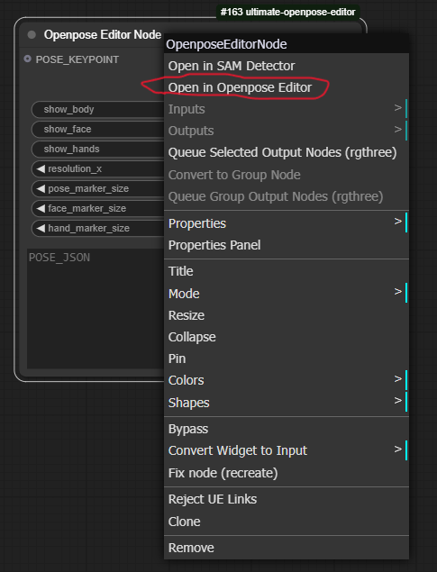
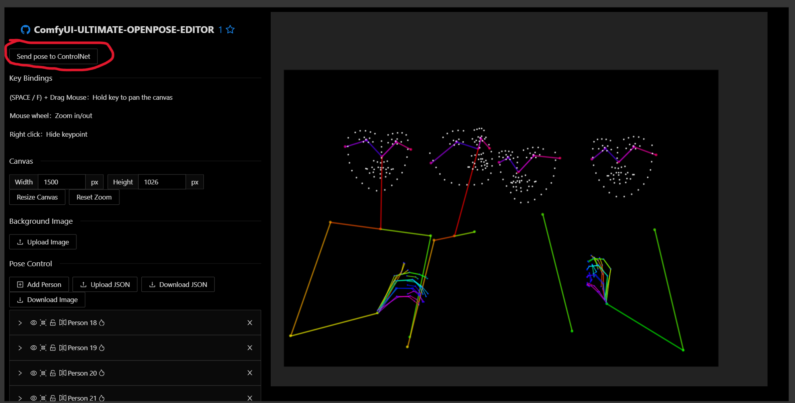
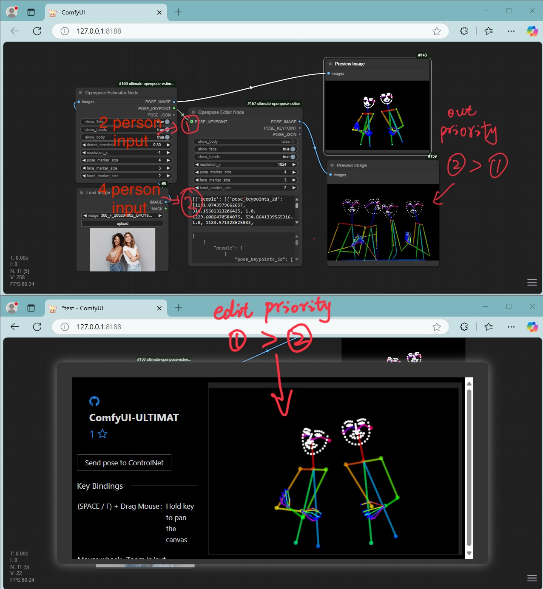
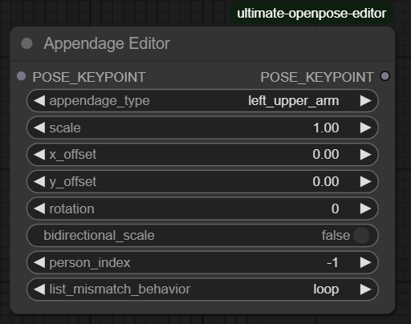

<div align="center">

# ComfyUI ultimate openpose editor

</div>

<p align="center">
  
</p>

This is an improved version of [ComfyUI-openpose-editor](https://github.com/huchenlei/ComfyUI-openpose-editor) 
in ComfyUI, enable input and output with flexible choices. Much more convenient and easier to use. It integrates the render function which you also can intall it separately from my [ultimate-openpose-render](https://github.com/westNeighbor/ComfyUI-ultimate-openpose-render) repo or search in the Custom Nodes Manager

If you like the project, please give me a star! ⭐

## Installation

- Manually install (**Recommend**), go to ComfyUI `/custom_nodes` directory
    ```bash
    git clone https://github.com/westNeighbor/ComfyUI-ultimate-openpose-editor
    cd ./ComfyUI-ultimate-openpose-editor
    pip install -r requirements.txt # if you use portable version, see below
    ```
    if you use portable version, install requirement accordingly, for example, I have portable in my E: disk
    ```bash
    E:/ComfyUI_windows_portable/python_embeded/python.exe -m pip install -r requirements.txt
    ```
- You can install through the `Manager -> Custom Nodes Manger` search method, but probably you will meet problem to open the editor cause the **Manager** change the folder name, check the folder name after installation and change the folder name in file **_./js/openpose_editor.js_** in line 110 to the actual folder name in your computer.

    For example, if you have folder name **_westNeighbor_ComfyUI-ultimate-openpose-editor_** after installed, you need to change
    ```bash
    src: "extensions/ComfyUI-ultimate-openpose-editor/ui/OpenposeEditor.html",
    ```
    to
    ```bash
    src: "extensions/westNeighbor_ComfyUI-ultimate-openpose-editor/ui/OpenposeEditor.html",
    ```

- Restart ComfyUI

## Usage
- Insert node by `Right Click -> ultimate-openpose -> Openpose Editor Node`
- `Right Click` on the node and select the `Open in Openpose Editor` to do the editting
    <p align="center">
      
    </p>
- send back after editting
    <p align="center">
      
    </p>
- `ESC` key to close, need to focus on the window first by clicking on the outer area of the editor window.

## Features
The node is very functional and rich features to fit all your needs.
- It is totally local running, no internet requiring like the [ComfyUI-openpose-editor](https://github.com/huchenlei/ComfyUI-openpose-editor)
- It can handle all kinds of situations

    - It can go without any input, you can get an empty image or add poses of persons in the editor ui.

    - It can accept POSE\_KEYPOINTS or poses in json format as input.

    - To edit poses, right click the node, and open the editor through `Open in Openpose Editor` menu. The send back poses will be shown in the pose json input area. Be ware that the edit priority is **POSE\_KEYPOINT > POSE\_JSON** 

    - It can output pose images, or POSE\_KEYPOINTS or the json poses. Be ware that the output priority is **POSE\_JSON > POSE\_KEYPOINT**

    - It integrates the render options too, so you can use it as an render node too, or check my [ultimate-openpose-render](https://github.com/westNeighbor/ComfyUI-ultimate-openpose-render) node.

    <p align="center">
      
    </p>

    - Quick options to scale part or overall of the poses. You also can scale specific person(pose) by set the `only_scale_pose_index` to the one you want to scale, set a number out of the index range to scale all poses. 
    **Note: the index is not necessary natural order \(e.g. from left to right\).**

## New Node
A new procedure editting node [AppendageEditorNode](https://github.com/westNeighbor/ComfyUI-ultimate-openpose-editor/pull/10) is added.
    <p align="center">
      
    </p>
- **Precise body part editing** for OpenPose keypoints with granular control over:
  - Arms: `left/right_upper_arm`, `left/right_forearm`, `left/right_full_arm`
  - Legs: `left/right_upper_leg`, `left/right_lower_leg`, `left/right_full_leg` 
  - Hands/Feet: `left/right_hand`, `left/right_foot`
  - Torso: `torso`, `shoulders`
- **Transform controls**: scale, rotation, x/y offset with animation support
- **Scaling modes**: 
  - `bidirectional_scale=True`: scales in all directions from pivot
  - `bidirectional_scale=False`: scales only away from body (prevents adjacent part interference)
- **Multi-person support** with configurable person index
- **Animation-friendly** with list parameter handling and mismatch behaviors

One can chain N Appendage Editors together, and then render the final result.


## Credits
- https://github.com/huchenlei/ComfyUI-openpose-editor
